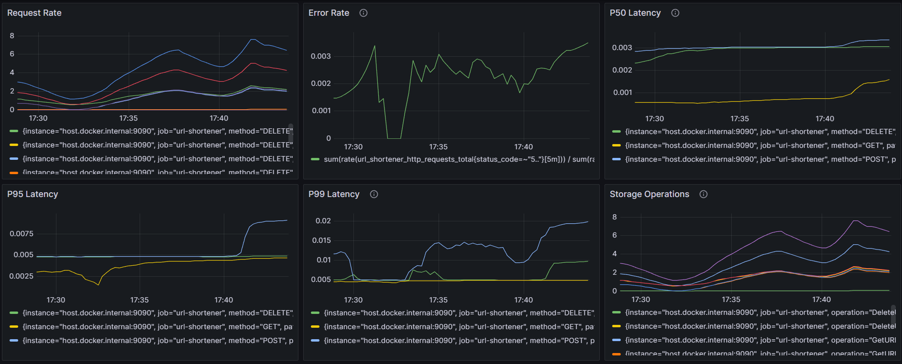

# Monitoring Infrastructure

A complete monitoring stack using Prometheus and Grafana for application metrics and visualization.

## Overview

This infrastructure provides real-time monitoring and visualization for the URL Shortener service, tracking:
- Request rates by HTTP method
- Error rates and status codes
- Latency percentiles (P50, P95, P99)
- Storage operations performance

## Quick Start

Start the monitoring stack:

```bash
docker-compose -f docker-compose.monitoring.yml up -d
```

Access the dashboards:
- **Grafana**: http://localhost:3000 (admin/admin)
- **Prometheus**: http://localhost:9091

## Dashboard



The Grafana dashboard displays:
- **Request Rate**: HTTP requests per second by method (DELETE, GET, POST, PUT)
- **Error Rate**: Application error tracking over time
- **P50/P95/P99 Latency**: Response time percentiles
- **Storage Operations**: Database operation metrics

## Configuration

### Prometheus
- Scrapes metrics every 15 seconds
- Target: `host.docker.internal:9090/metrics`
- Config: `prometheus/prometheus.yml`

### Grafana
- Pre-configured Prometheus datasource
- Provisioning: `grafana/provisioning/`

## Services

| Service | Port | Description |
|---------|------|-------------|
| Prometheus | 9091 | Metrics collection and storage |
| Grafana | 3000 | Visualization dashboards |
